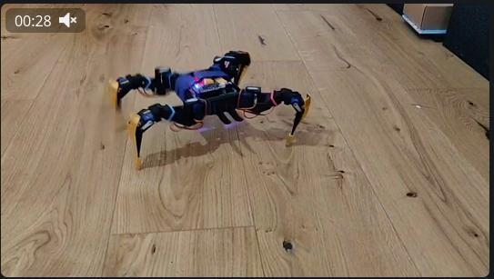
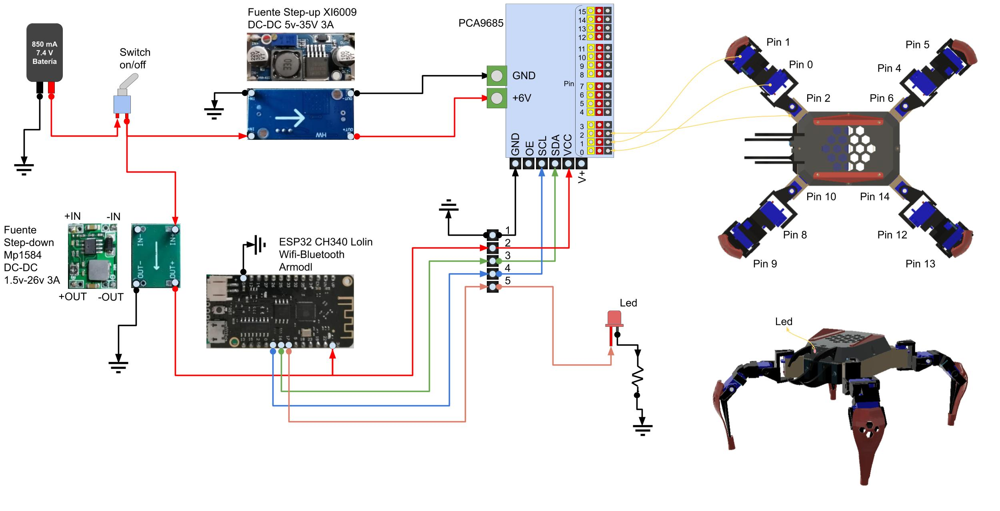
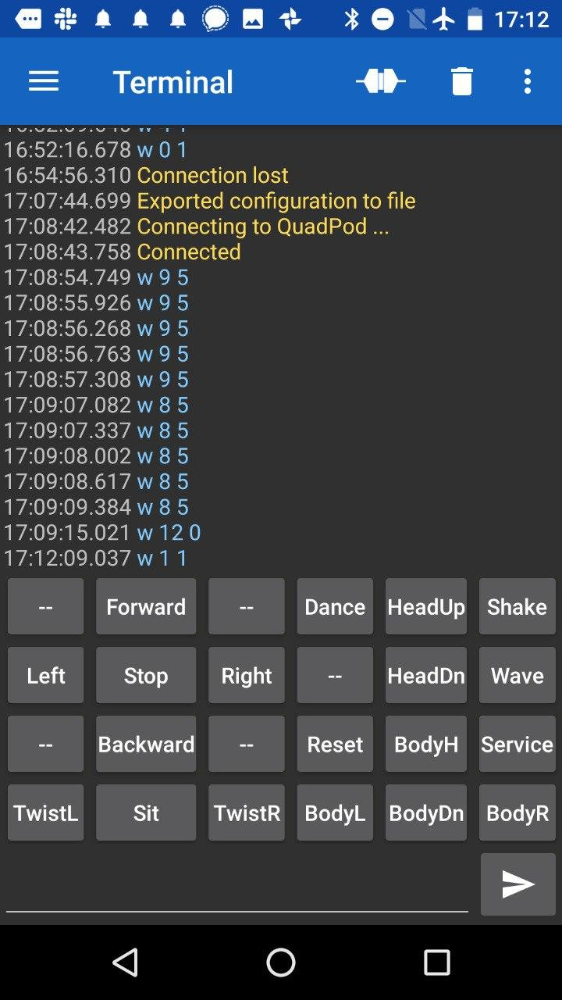
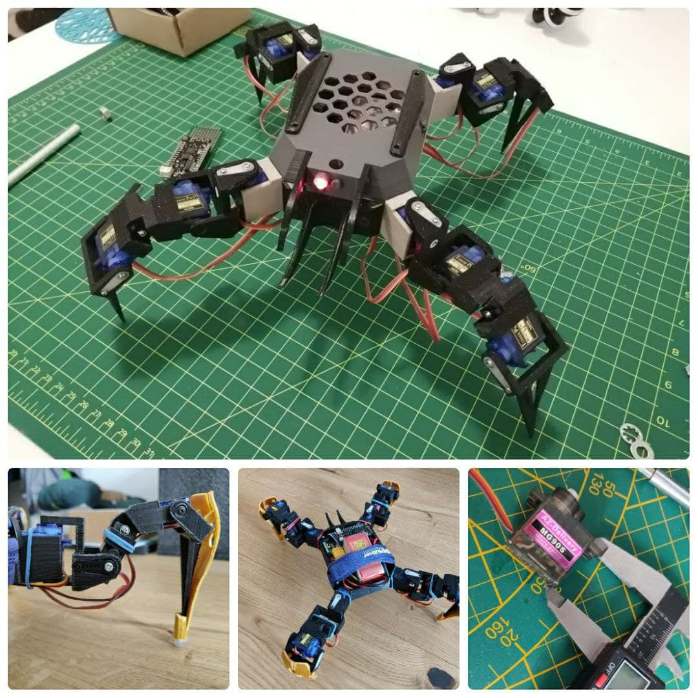

# Quadpod ESP32 Bluetooth Alternative

One year ago, in the middle of Covid19, with my [brother](https://www.youtube.com/user/svporion/featured) we did this robot alternative, it is a remix of a popular SG90 12DOF robot in [Thingiverse](https://www.thingiverse.com/thing:3122758). My brother did again some 3d print parts and I did the migration from two Arduino micro controllers to only one micro controller using the ESP32 with FreeRTOS tasks. Also the robot uses a Bluetooth connection for improve usability and power consumption, but is possible controlling it with WiFI connection too.

<a href="https://youtu.be/UDZQokIno-8" target="_blank"></a>

# NOTE:

The robot is useful for understand many things, and is funny making it, but the speed and performance is a little bit buggy, we recommended using **MG90S** servos instead SG90 plastic servo, or maybe using better servos, also the hexapod config will be better, but again, for learning this model is fine.

# 3D Print

The last improved parts are here in this repository, but you also to able some details and photos of this models in the our [Thingiverse](https://www.thingiverse.com/thing:4644707) page.


# Electric diagram



# Build and Flashing

First to all, please install PlatformIO with your favourite IDE (i.e. VSCode). Follow [this](https://platformio.org/platformio-ide) instructions. Also, you should install [git](http://git-scm.com/) in your system.

## Clone the repo

```sh
git clone https://github.com/hpsaturn/quadpod.git
```

Connect the ESP32 via USB. In Windows 10, drivers are installed automatically. I guess with other OS will be automatically installed too.

Open cloned folder with your PlatformIO IDE and build & upload it. For details please see the [documentation](https://docs.platformio.org/en/latest/integration/ide/vscode.html#quick-start), but the process flow is more easy than Arduino IDE flow, but you can also import it to the Arduino IDE if you want.


Or after clone also you can build and upload the current firmware from CLI:

```shell
cd quadpod && pio run --target upload
```

# Bluetooth control




For now, you can use this app: [Serial Bluetooth Terminal](https://play.google.com/store/apps/details?id=de.kai_morich.serial_bluetooth_terminal) and donwload the file `serial_bluetooth_terminal.cfg.txt` that is under `bt` folder of this project, then send it to your phone and import it with this application for get all commands and buttons for controlling the robot.


# Credits

Special thanks to [Santiago Vanegas](https://www.thingiverse.com/alfazoom/designs) for 3D models and many improvements.

---

### Donations:

If you want invite me a coffee in:  

https://hpsaturn.com/about/  
https://paypal.me/hpsaturn

### Or support my initiative

CanAirIO Citizen network for monitoring air quality https://canair.io

---


